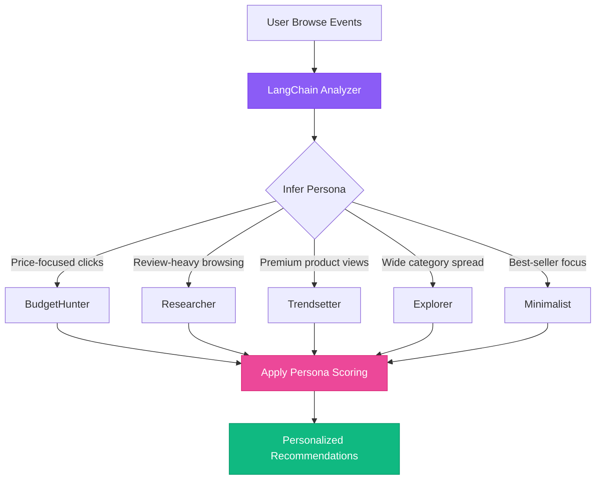

import Callout from '@components/Callout.astro';
import PipelineOverview from '@components/PipelineOverview.astro';
import PipelineStage from '@components/PipelineStage.astro';
import DomainComparison from '@components/DomainComparison.astro';
import StrategyTable from '@components/StrategyTable.astro';

For years, the Twitter algorithm was a black box—a mysterious force governing who saw your witty remarks and who didn't. We prayed to the engagement gods, performed strange hashtag rituals, and sacrificed our best memes, all in the hope of going viral. Then, in a move of unprecedented transparency, xAI and Elon Musk **open-sourced the whole thing** [^1].

We now have the keys to the kingdom. We can see the bizarre, brilliant, and sometimes baffling logic that decides the fate of **500 million tweets a day**. But this isn't just about getting more likes. The architecture behind the X algorithm is a masterclass in building large-scale recommendation engines—a blueprint that can be adapted for almost any field, especially e-commerce.

<Callout type="insight" title="The Core Insight">
At its heart, Twitter's algorithm and an e-commerce recommendation engine solve the **exact same problem**: from millions of candidates, find the few items most relevant to a specific user at a specific moment.
</Callout>

In this post, we'll do two things:

1. **Demystify the X Algorithm**: We'll break down how it works in technical detail and show you how to make your tweets more popular.
2. **Apply it to E-Commerce**: We'll show you how to take the core principles and apply them to an online store, complete with code examples from a real demo project.

---

## Part 1: How the X Algorithm Really Works

The X recommendation pipeline is a multi-stage funnel designed to answer one question: out of the millions of tweets posted every minute, which handful should it show *you*?

It's a process of organized chaos, split into three main phases:

<PipelineOverview
  title="The X Recommendation Funnel"
  subtitle="From 500 million tweets to your personalized timeline"
  steps={[
    {
      label: "All Tweets",
      sublabel: "~500M/day",
      iconType: "input",
      color: "#3b82f6"
    },
    {
      label: "Candidate Generation",
      sublabel: "Thunder + Phoenix",
      iconType: "generate",
      color: "#10b981"
    },
    {
      label: "Ranking",
      sublabel: "ML Scoring",
      iconType: "rank",
      color: "#f59e0b"
    },
    {
      label: "Filtering",
      sublabel: "Visibility Rules",
      iconType: "filter",
      color: "#8B5CF6"
    },
    {
      label: "Your Timeline",
      sublabel: "~50 tweets",
      iconType: "output",
      color: "#ec4899"
    }
  ]}
/>

### The Candidate Pipeline: Lego Blocks of Recommendation

Behind the scenes, the X algorithm is orchestrated through a sophisticated pipeline with distinct components, each with a specific job. Think of it like a factory assembly line where each station adds value before passing the work to the next stage.

Here's how it works, broken down into the **six core components**:

<PipelineStage
  title="Twitter/X Recommendation Pipeline"
  subtitle="The 6-stage architecture powering 500 million daily recommendations"
  domain="twitter"
  stages={[
    {
      name: "Source",
      iconType: "source",
      execution: "parallel",
      description: "Fetches candidates from Thunder (in-network) and Phoenix (out-of-network) simultaneously.",
      details: [
        "Thunder: Latest tweets from accounts you follow",
        "Phoenix: Real Graph discovers tweets you might like",
        "Out-of-network accounts for 50% of your timeline",
        "Runs in parallel for speed optimization"
      ],
      color: "#10b981"
    },
    {
      name: "Hydrator",
      iconType: "hydrator",
      execution: "parallel",
      description: "Enriches each tweet with metadata and features for scoring.",
      details: [
        "Author info: follower count, verification status",
        "Content features: text length, media type, sentiment",
        "Engagement signals: current likes, replies, retweets",
        "User interaction history with the author"
      ],
      color: "#3b82f6"
    },
    {
      name: "Filter",
      iconType: "filter",
      execution: "sequential",
      description: "Removes candidates that shouldn't be shown based on rules.",
      details: [
        "Blocked or muted accounts",
        "Already-seen tweets",
        "NSFW or policy-violating content",
        "Reported accounts filter"
      ],
      color: "#ef4444"
    },
    {
      name: "Scorer",
      iconType: "scorer",
      execution: "sequential",
      description: "ML model scores each tweet on engagement probability.",
      details: [
        "Reply probability (most valuable signal)",
        "Like probability",
        "Dwell time prediction",
        "Profile click probability"
      ],
      color: "#8b5cf6"
    },
    {
      name: "Selector",
      iconType: "selector",
      execution: "sequential",
      description: "Sorts by score and picks top candidates with diversity rules.",
      details: [
        "Sort all candidates by engagement score",
        "Apply diversity rules (not all from one author)",
        "Ensure topic variety in timeline",
        "Select final ~50 tweets to show"
      ],
      color: "#f59e0b"
    },
    {
      name: "SideEffect",
      iconType: "sideeffect",
      execution: "async",
      description: "Background tasks that don't block the main response.",
      details: [
        "Cache embeddings for future requests",
        "Log what was shown and interactions",
        "Update user preference models",
        "Feedback loop for model improvement"
      ],
      color: "#6366f1"
    }
  ]}
/>

### Deep Dive: Understanding Parallel vs Sequential Execution

<Callout type="info" title="Why Does Execution Order Matter?">
The brilliance of this design is knowing **when** to parallelize and when to serialize. Getting this wrong can mean the difference between a 200ms response and a 2-second timeout.
</Callout>

#### Parallel Stages: Source & Hydrator

The **Source** and **Hydrator** stages run in parallel because they operate on independent data:

```typescript
// Parallel candidate sourcing
const [inNetworkTweets, outOfNetworkTweets] = await Promise.all([
  thunder.fetchFromFollowing(userId),    // Your follows
  phoenix.fetchFromRealGraph(userId)     // Discovered content
]);

// Parallel hydration - each tweet can be enriched independently
const hydratedTweets = await Promise.all(
  candidates.map(async (tweet) => ({
    ...tweet,
    author: await getAuthorMetadata(tweet.authorId),
    engagement: await getCurrentEngagement(tweet.id),
    userHistory: await getUserInteractionHistory(userId, tweet.authorId),
  }))
);
```

#### Sequential Stages: Filter → Scorer → Selector

These stages **must** run in sequence because each depends on the previous:

```typescript
// Sequential pipeline - order matters!
let candidates = hydratedTweets;

// 1. Filter first (reduces work for scorer)
candidates = filterCandidates(candidates, {
  blockedUsers: user.blockedAccounts,
  seenTweets: user.recentlySeenIds,
  contentPolicies: PLATFORM_RULES
});

// 2. Score remaining candidates
candidates = await scoreCandidates(candidates, {
  model: 'grok-engagement-v3',
  userProfile: user.preferences
});

// 3. Select top results with diversity
const timeline = selectWithDiversity(candidates, {
  limit: 50,
  maxPerAuthor: 3,
  topicVariety: true
});
```

<Callout type="warning" title="Performance Critical">
By filtering **before** scoring, X reduces the number of expensive ML inference calls. If you have 10,000 candidates and filtering removes 40%, you save 4,000 model calls per request.
</Callout>

#### Async Stage: SideEffect

The SideEffect stage runs **after** the response is sent, using background workers:

```typescript
// Don't block the response - fire and forget
setImmediate(async () => {
  await Promise.all([
    cache.set(`timeline:${userId}`, timeline, TTL_1_HOUR),
    analytics.log({ userId, shown: timeline.map(t => t.id) }),
    userModel.updatePreferences(userId, timeline)
  ]);
});

// Response is already sent to user
return timeline;
```

### Why This Architecture Matters

The parallelization strategy enables X to serve personalized feeds in **under 500ms** to **500 million users**. Here's the math:

| Approach | Latency | Why |
|----------|---------|-----|
| All Sequential | ~2000ms | Each stage waits for the previous |
| All Parallel | Impossible | Dependencies would break |
| Hybrid (X's approach) | ~400ms | Parallel where safe, sequential where required |

---

### How to Make Your Tweets More Popular: The Unofficial Guide

Now that we know the logic, we can derive some best practices. Here's how to align your content with the algorithm's preferences:

<StrategyTable
  title="Algorithm-Aligned Tweet Strategies"
  subtitle="Derived from analysis of the open-sourced X codebase"
  strategies={[
    {
      strategy: "Spark Replies, Not Just Likes",
      reason: "The Scorer values replies more than any other signal. Ask open-ended questions or state a controversial (but not insane) opinion.",
      funnyTruth: "The algorithm thinks a 200-comment argument about pineapple on pizza is more important than a Nobel Prize announcement.",
      iconType: "reply"
    },
    {
      strategy: "Post More Videos & Images",
      reason: "Media increases 'Dwell Time.' The longer someone pauses on your tweet, the more the Scorer thinks it's valuable content.",
      funnyTruth: "Your cat video is literally buying you milliseconds of attention, and the AI is eating it up.",
      iconType: "media"
    },
    {
      strategy: "Engage with Others First",
      reason: "The Real Graph model connects you to new audiences through shared interests. Replying to bigger accounts in your niche is the fastest way to get discovered.",
      funnyTruth: "You're basically riding the coattails of more popular people. It's the digital equivalent of laughing at the boss's jokes.",
      iconType: "engage"
    },
    {
      strategy: "Write Longer, Thoughtful Tweets",
      reason: "Again, Dwell Time. A multi-paragraph tweet forces people to stop and read, signaling to the Scorer that this content is substantive.",
      funnyTruth: "The algorithm can't tell the difference between a profound philosophical insight and a long, rambling conspiracy theory. It just sees 'time on screen.'",
      iconType: "write"
    },
    {
      strategy: "Get Verified (If You Can)",
      reason: "The code explicitly gives a ranking boost to verified (paid) users in the Hydrator stage. It's a direct, thumb-on-the-scale advantage.",
      funnyTruth: "It's the digital equivalent of a nightclub's velvet rope. You're not necessarily more interesting, but you paid for the bouncer's attention.",
      iconType: "verified"
    }
  ]}
/>

---

## Part 2: Stealing the Blueprint for E-Commerce

At its core, Twitter's algorithm is a **recommendation engine**. It recommends tweets. An e-commerce store recommends products. The underlying problem is identical: from a large catalog, find the few items most relevant to a specific user at a specific time.

<DomainComparison
  title="The Universal Recommendation Pattern"
  subtitle="Same architecture, different domains"
  comparisons={[
    { twitter: "Tweets", ecommerce: "Products", description: "The items being recommended" },
    { twitter: "Engagement Score", ecommerce: "Purchase Probability", description: "The signal we're optimizing for" },
    { twitter: "Real Graph (Phoenix)", ecommerce: "Collaborative Filtering", description: "Users who liked X also liked Y" },
    { twitter: "Thunder (In-Network)", ecommerce: "Browse History", description: "Explicit user preferences" },
    { twitter: "Dwell Time", ecommerce: "Time on Product Page", description: "Implicit interest signals" },
    { twitter: "Verified Boost", ecommerce: "Featured/Sponsored Products", description: "Business rule overrides" }
  ]}
/>

Let's adapt Twitter's six-stage pipeline to an online store, using the **Hoodtopia** demo project as our guide [^2]. Hoodtopia is an AI-powered e-commerce application that demonstrates how to build intelligent product discovery using LangChain, OpenAI, and adaptive shopper personas.

### Building the E-Commerce Pipeline

<PipelineStage
  title="E-Commerce Recommendation Pipeline"
  subtitle="Applying Twitter's architecture to product recommendations"
  domain="ecommerce"
  stages={[
    {
      name: "Source",
      iconType: "source",
      execution: "parallel",
      description: "Fetch product candidates from multiple data sources simultaneously.",
      details: [
        "Browse History: Products user has viewed",
        "Semantic Search: AI-powered query matching",
        "Category Neighbors: Related products",
        "Collaborative: 'Users also bought'"
      ],
      color: "#8b5cf6"
    },
    {
      name: "Hydrator",
      iconType: "hydrator",
      execution: "parallel",
      description: "Enrich each product with real-time metadata and user context.",
      details: [
        "Price and discount information",
        "Review count and average rating",
        "Real-time stock status",
        "User preference alignment score"
      ],
      color: "#ec4899"
    },
    {
      name: "Filter",
      iconType: "filter",
      execution: "sequential",
      description: "Remove products that shouldn't be shown to this user.",
      details: [
        "Out of stock items",
        "Outside user's price range",
        "Already in cart",
        "Poor review threshold"
      ],
      color: "#ef4444"
    },
    {
      name: "Scorer",
      iconType: "scorer",
      execution: "sequential",
      description: "Score products based on user persona and purchase likelihood.",
      details: [
        "BudgetHunter: Price sensitivity × 1.5",
        "Researcher: Review depth × 1.2",
        "Trendsetter: Premium boost × 1.3",
        "Explorer: New arrivals × 1.1"
      ],
      color: "#f59e0b"
    },
    {
      name: "Selector",
      iconType: "selector",
      execution: "sequential",
      description: "Select top products with diversity constraints.",
      details: [
        "Sort by composite score",
        "Max 2 products per color",
        "Mix of price points",
        "Include at least 1 new arrival"
      ],
      color: "#10b981"
    },
    {
      name: "SideEffect",
      iconType: "sideeffect",
      execution: "async",
      description: "Background optimization and analytics.",
      details: [
        "Cache recommendations (1 hour TTL)",
        "Log impression data",
        "Update user preference model",
        "A/B test tracking"
      ],
      color: "#6366f1"
    }
  ]}
/>

### Implementation: The Code

Let's walk through each stage with production-ready TypeScript code. Each example includes detailed comments explaining the *why* behind each decision.

#### Stage 1: Source (Parallel Execution)

The Source stage is responsible for gathering an initial pool of product candidates from multiple data sources. The key insight here is that these sources are **completely independent** of each other - fetching a user's browse history doesn't depend on the results of semantic search, and vice versa.

This independence allows us to use `Promise.all()` to run all fetches concurrently, dramatically reducing latency. If each fetch takes 100ms, running them sequentially would take 400ms, but running them in parallel takes only ~100ms total.

```typescript
/**
 * ProductCandidate represents the minimal data needed to identify
 * a product for recommendation. We keep this interface lean because
 * we'll enrich it with more data in the Hydrator stage.
 */
interface ProductCandidate {
  id: string;
  name: string;
  price: number;
  category: string;
}

/**
 * Sources product candidates from multiple independent data streams.
 *
 * Key architectural decision: We use Promise.all() because each data
 * source is independent. This is the same pattern Twitter uses with
 * Thunder (in-network) and Phoenix (out-of-network) running in parallel.
 *
 * @param userId - The current user's ID for personalization
 * @param query - Optional search query for semantic matching
 * @returns Deduplicated array of product candidates
 */
async function sourceProducts(
  userId: string,
  query?: string
): Promise<ProductCandidate[]> {
  // Promise.all() executes all fetches concurrently
  // If one fails, the entire Promise rejects - consider Promise.allSettled()
  // for more fault-tolerant implementations
  const [
    browseHistory,      // Products user has viewed recently
    semanticResults,    // AI-powered search results (if query provided)
    categoryNeighbors,  // Related products in same category
    collaborativeResults // "Users who bought X also bought Y"
  ] = await Promise.all([
    fetchBrowseHistory(userId),
    query ? getSemanticSearchResults(query) : [],
    getCategoryNeighbors(getCurrentCategory()),
    getCollaborativeFiltering(userId)
  ]);

  // Deduplicate using a Set for O(1) lookup performance
  // This is critical because the same product might appear in
  // multiple sources (e.g., a viewed item that's also trending)
  const seen = new Set<string>();
  const candidates: ProductCandidate[] = [];

  for (const product of [
    ...browseHistory,
    ...semanticResults,
    ...categoryNeighbors,
    ...collaborativeResults
  ]) {
    if (!seen.has(product.id)) {
      seen.add(product.id);
      candidates.push(product);
    }
  }

  return candidates;
}
```

<Callout type="info" title="Why Deduplicate Here?">
Deduplication at the Source stage prevents wasted work downstream. If a product appears in 3 sources, we'd otherwise hydrate, filter, and score it 3 times - tripling our compute costs.
</Callout>

#### Stage 2: Hydrator (Parallel Execution)

The Hydrator enriches each product candidate with real-time metadata needed for filtering and scoring. Like the Source stage, each product can be hydrated independently, making this another perfect candidate for parallel execution.

```typescript
/**
 * HydratedProduct extends the base candidate with rich metadata.
 * This data enables intelligent filtering and persona-based scoring.
 */
interface HydratedProduct extends ProductCandidate {
  reviews: { count: number; average: number };
  stock: { available: number; status: 'in_stock' | 'low' | 'out' };
  shipping: { estimate: string; free: boolean };
  userPreferenceScore: number; // Pre-computed affinity score (0-1)
}

/**
 * Enriches product candidates with real-time metadata.
 *
 * Architecture note: Each product hydration is independent, so we
 * parallelize with Promise.all(). This mirrors Twitter's approach
 * where each tweet is hydrated with author info, engagement counts,
 * and user interaction history simultaneously.
 *
 * Performance consideration: For very large candidate sets (1000+),
 * consider batching to avoid overwhelming downstream services.
 *
 * @param candidates - Raw product candidates from Source stage
 * @param userId - User ID for computing preference scores
 * @returns Products enriched with metadata for filtering/scoring
 */
async function hydrateProducts(
  candidates: ProductCandidate[],
  userId: string
): Promise<HydratedProduct[]> {
  return Promise.all(
    candidates.map(async (product) => ({
      ...product,
      // Each of these fetches happens concurrently PER product
      // AND all products are hydrated concurrently with each other
      reviews: await getProductReviews(product.id),
      stock: await checkInventory(product.id),
      shipping: await getShippingInfo(product.id),
      // This computes how well the product matches user preferences
      // based on past behavior, category affinity, price range, etc.
      userPreferenceScore: await computeUserPreference(userId, product),
    }))
  );
}
```

#### Stage 3: Filter (Sequential Execution)

The Filter stage removes products that shouldn't be shown. Unlike the previous stages, the order of filter checks matters for performance - we want to run the **cheapest checks first** to eliminate candidates before running expensive checks.

```typescript
/**
 * UserFilters captures the user's explicit and implicit preferences.
 * These can come from UI filters, user settings, or inferred behavior.
 */
interface UserFilters {
  maxPrice: number;
  minRating: number;
  cartItems: string[];      // Products already in cart
  excludeOutOfStock: boolean;
}

/**
 * Filters products based on user preferences and business rules.
 *
 * CRITICAL: Filter order matters for performance!
 * We order checks from cheapest to most expensive:
 * 1. Stock status (simple boolean)
 * 2. Price comparison (simple numeric)
 * 3. Cart inclusion (array lookup)
 * 4. Review threshold (conditional check)
 *
 * JavaScript's short-circuit evaluation means if an early check
 * fails, later checks aren't executed - saving compute time.
 *
 * @param products - Hydrated products from previous stage
 * @param filters - User's filter preferences
 * @returns Products passing all filter criteria
 */
function filterProducts(
  products: HydratedProduct[],
  filters: UserFilters
): HydratedProduct[] {
  return products.filter(product => {
    // Check 1: Stock status (O(1) - cheapest)
    // Run this first because out-of-stock items are common
    if (filters.excludeOutOfStock && product.stock.status === 'out') {
      return false;
    }

    // Check 2: Price ceiling (O(1))
    // Simple numeric comparison, very fast
    if (product.price > filters.maxPrice) {
      return false;
    }

    // Check 3: Already in cart (O(n) where n = cart size)
    // Don't recommend items user is already buying
    if (filters.cartItems.includes(product.id)) {
      return false;
    }

    // Check 4: Review quality (conditional O(1))
    // Only apply rating filter if product has enough reviews
    // to be statistically meaningful (avoids penalizing new products)
    if (product.reviews.count > 10 && product.reviews.average < filters.minRating) {
      return false;
    }

    return true;
  });
}
```

<Callout type="warning" title="Why Filter Before Scoring?">
Scoring is computationally expensive (especially with ML models). By filtering aggressively first, we reduce the number of products that need scoring. If filtering removes 40% of candidates, we save 40% of our scoring compute budget.
</Callout>

#### Stage 4: Scorer (Sequential Execution)

This is where the magic happens. The Scorer assigns a relevance score to each product based on the user's **inferred persona**. This is directly analogous to Twitter's Grok-1 model predicting engagement probability - we're predicting purchase probability.

The key insight is that different users value different product attributes. A budget-conscious shopper cares about price and free shipping, while a trend-setter cares about newness and premium positioning. By multiplying scoring weights, we can dramatically reorder recommendations for different personas.

```typescript
/**
 * UserPersona represents behavioral archetypes identified through
 * browsing patterns. These can be inferred using ML models or
 * simple heuristics based on click/view/purchase history.
 */
type UserPersona =
  | 'BudgetHunter'   // Price-sensitive, seeks deals
  | 'Researcher'     // Review-focused, thorough decision-maker
  | 'Minimalist'     // Wants proven best-sellers, low effort
  | 'Trendsetter'    // Premium/new items, early adopter
  | 'Explorer';      // Discovery-focused, loves variety

interface ScoredProduct extends HydratedProduct {
  score: number;
  scoreBreakdown: Record<string, number>; // For debugging/explainability
}

/**
 * Scores products based on user persona using multiplicative weights.
 *
 * Architecture insight: We use multiplicative scoring (not additive)
 * because it allows bonuses to compound. A product that's both cheap
 * AND has free shipping gets a 1.5 × 1.3 = 1.95x boost for BudgetHunters.
 *
 * The scoreBreakdown field enables explainability - you can show users
 * "Recommended because: great reviews, free shipping" by inspecting
 * which multipliers were applied.
 *
 * @param products - Filtered products from previous stage
 * @param persona - User's inferred shopping persona
 * @returns Products with computed relevance scores
 */
function scoreProducts(
  products: HydratedProduct[],
  persona: UserPersona
): ScoredProduct[] {
  return products.map(product => {
    // Start with the base affinity score from hydration
    // This captures historical user-product interactions
    let score = product.userPreferenceScore;
    const breakdown: Record<string, number> = { base: score };

    // Apply persona-specific multipliers
    // These values should be tuned through A/B testing in production
    switch (persona) {
      case 'BudgetHunter':
        // Price sensitivity: boost affordable items significantly
        if (product.price < 70) {
          score *= 1.5;
          breakdown.priceBonus = 1.5;
        }
        // Free shipping is huge for budget shoppers
        if (product.shipping.free) {
          score *= 1.3;
          breakdown.freeShipping = 1.3;
        }
        break;

      case 'Researcher':
        // These users trust social proof - reward well-reviewed items
        if (product.reviews.count > 50) {
          score *= 1.2;
          breakdown.reviewDepth = 1.2;
        }
        // High ratings matter more than quantity for this persona
        if (product.reviews.average >= 4.5) {
          score *= 1.3;
          breakdown.highRating = 1.3;
        }
        break;

      case 'Trendsetter':
        // Premium positioning signals quality to this persona
        if (product.price > 100) {
          score *= 1.2;
          breakdown.premiumPrice = 1.2;
        }
        // New arrivals are highly valued - early adopter mentality
        if ((product as any).isNew) {
          score *= 1.4;
          breakdown.newArrival = 1.4;
        }
        break;

      case 'Minimalist':
        // This persona wants proven winners, minimal research
        if ((product as any).isBestSeller) {
          score *= 1.5;
          breakdown.bestSeller = 1.5;
        }
        break;

      case 'Explorer':
        // Counterintuitively, boost items with LOW affinity scores
        // These users want to discover new things, not see the same stuff
        if (product.userPreferenceScore < 0.3) {
          score *= 1.3;
          breakdown.novelty = 1.3;
        }
        break;
    }

    return { ...product, score, scoreBreakdown: breakdown };
  });
}
```

<Callout type="success" title="Persona-Based Scoring">
This scoring approach is inspired by the Hoodtopia demo project, which uses LangChain to dynamically infer user personas from browsing behavior and adjust recommendations accordingly.
</Callout>

#### Stage 5: Selector (Sequential Execution)

The Selector picks the final products to display while enforcing **diversity constraints**. Without diversity rules, you might show 20 black hoodies because they all score highest - a terrible user experience.

This mirrors Twitter's approach of ensuring timeline variety: you don't want all tweets from one author or all about one topic, even if they individually score highest.

```typescript
interface SelectionConfig {
  limit: number;           // Max products to return
  maxPerColor: number;     // Prevent color monotony
  ensureNewArrivals: boolean; // Guarantee fresh content
}

/**
 * Selects top-scoring products while enforcing diversity constraints.
 *
 * Algorithm: Greedy selection with constraints
 * 1. Sort all products by score (descending)
 * 2. Iterate through sorted list
 * 3. Accept product if it doesn't violate diversity rules
 * 4. Skip products that would create too much repetition
 * 5. Optionally ensure certain content types are included
 *
 * This is O(n log n) for the sort + O(n) for the selection pass.
 *
 * @param scored - Products with computed scores
 * @param config - Diversity and limit configuration
 * @returns Final product selection for display
 */
function selectTopProducts(
  scored: ScoredProduct[],
  config: SelectionConfig
): ScoredProduct[] {
  // Sort by score descending - highest relevance first
  // Use spread to avoid mutating the input array
  const sorted = [...scored].sort((a, b) => b.score - a.score);

  // Track diversity constraints
  const colorCounts: Record<string, number> = {};
  const selected: ScoredProduct[] = [];
  let hasNewArrival = false;

  for (const product of sorted) {
    // Stop when we have enough products
    if (selected.length >= config.limit) break;

    // Diversity check: limit products per color
    // This prevents "all black hoodies" syndrome
    const color = (product as any).color || 'unknown';
    colorCounts[color] = (colorCounts[color] || 0) + 1;

    if (colorCounts[color] > config.maxPerColor) {
      continue; // Skip - too many of this color already
    }

    // Track whether we've included a new arrival
    if ((product as any).isNew) {
      hasNewArrival = true;
    }

    selected.push(product);
  }

  // Ensure at least one new arrival if configured
  if (config.ensureNewArrivals && !hasNewArrival) {
    const newArrival = sorted.find(p => (p as any).isNew);
    if (newArrival && !selected.includes(newArrival)) {
      selected.pop(); // Remove lowest scored
      selected.push(newArrival);
    }
  }

  return selected;
}
```

#### Stage 6: SideEffect (Async Execution)

```typescript
async function runSideEffects(
  userId: string,
  recommendations: ScoredProduct[]
): Promise<void> {
  // Fire and forget - don't await in main flow
  setImmediate(async () => {
    try {
      await Promise.all([
        // Cache for 1 hour
        cache.set(
          `recommendations:${userId}`,
          recommendations.map(r => r.id),
          { ttl: 3600 }
        ),

        // Log impressions for analytics
        analytics.logImpressions({
          userId,
          productIds: recommendations.map(r => r.id),
          scores: recommendations.map(r => r.score),
          timestamp: new Date()
        }),

        // Update user preference model
        userModel.recordExposure(userId, recommendations),

        // A/B test tracking
        experiments.track('rec-algo-v3', userId, recommendations.length)
      ]);
    } catch (error) {
      // Log but don't throw - side effects shouldn't crash main flow
      console.error('Side effect error:', error);
    }
  });
}
```

### Putting It All Together

Here's the complete pipeline orchestration:

```typescript
async function getRecommendations(
  userId: string,
  options: {
    query?: string;
    persona?: UserPersona;
    filters?: Partial<UserFilters>;
  } = {}
): Promise<ScoredProduct[]> {
  const startTime = Date.now();

  // Stage 1: Source (Parallel)
  const candidates = await sourceProducts(userId, options.query);
  console.log(`[Source] ${candidates.length} candidates in ${Date.now() - startTime}ms`);

  // Stage 2: Hydrate (Parallel)
  const hydrated = await hydrateProducts(candidates, userId);
  console.log(`[Hydrate] Enriched ${hydrated.length} products`);

  // Stage 3: Filter (Sequential)
  const filtered = filterProducts(hydrated, {
    maxPrice: options.filters?.maxPrice ?? 500,
    minRating: options.filters?.minRating ?? 3.0,
    cartItems: options.filters?.cartItems ?? [],
    excludeOutOfStock: options.filters?.excludeOutOfStock ?? true
  });
  console.log(`[Filter] ${filtered.length} passed filters`);

  // Stage 4: Score (Sequential)
  const persona = options.persona ?? await inferPersona(userId);
  const scored = scoreProducts(filtered, persona);
  console.log(`[Score] Scored for ${persona} persona`);

  // Stage 5: Select (Sequential)
  const selected = selectTopProducts(scored, {
    limit: 20,
    maxPerColor: 3,
    ensureNewArrivals: true
  });
  console.log(`[Select] Final ${selected.length} recommendations`);

  // Stage 6: SideEffect (Async - doesn't block)
  runSideEffects(userId, selected);

  console.log(`[Total] ${Date.now() - startTime}ms`);
  return selected;
}
```

---

## Part 3: Advanced Patterns from Hoodtopia

The Hoodtopia demo project [^2] takes this architecture further by integrating **LangChain** and **OpenAI** for intelligent persona inference:



### LangChain Integration Example

```python
from langchain import LLMChain, PromptTemplate
from langchain.chat_models import ChatOpenAI

persona_prompt = PromptTemplate(
    input_variables=["browse_history", "time_spent", "price_range"],
    template="""
    Analyze this shopping behavior and classify the user persona:

    Browse History: {browse_history}
    Average Time on Products: {time_spent} seconds
    Price Range Viewed: ${price_range[0]} - ${price_range[1]}

    Classify as one of: BudgetHunter, Researcher, Trendsetter, Explorer, Minimalist

    Respond with just the persona name and a confidence score (0-1).
    """
)

chain = LLMChain(
    llm=ChatOpenAI(model="gpt-4o-mini", temperature=0),
    prompt=persona_prompt
)

async def infer_persona_with_llm(user_id: str) -> tuple[str, float]:
    history = await get_browse_history(user_id)
    result = await chain.arun(
        browse_history=history.products,
        time_spent=history.avg_dwell_time,
        price_range=history.price_range
    )
    persona, confidence = parse_llm_response(result)
    return persona, confidence
```

---

## The Power of This Architecture

<Callout type="success" title="Why This Pattern Works">
By applying the same six-component pipeline to e-commerce, you get:

- **Speed**: Parallel execution for independent operations
- **Scalability**: Each component can be optimized independently
- **Flexibility**: Easy to swap components (e.g., different scorers for different user types)
- **Maintainability**: Clear separation of concerns
- **Testability**: Each stage can be unit tested in isolation
</Callout>

---

## Conclusion: The Future is Conversational and Adaptive

What the open-sourcing of the X algorithm and projects like Hoodtopia show us is that the future of the web is **conversational and adaptive**. We are moving away from static, one-size-fits-all experiences toward systems that understand context, intent, and individual preferences.

Whether you're trying to get more engagement on a tweet or sell more products, the core principles are the same:

1. **Source** a broad set of relevant candidates using both explicit user signals (history, preferences) and implicit signals (semantic similarity, collaborative patterns)
2. **Hydrate** them with rich metadata that enables better decision-making downstream
3. **Filter** aggressively to remove unsuitable candidates early
4. **Score** based on user intent and business goals
5. **Select** the best candidates while maintaining diversity
6. **Optimize** with async tasks that improve future performance

By understanding this simple but powerful pattern, you can build smarter, more engaging experiences for your users, no matter what you're selling.

<Callout type="insight" title="The Key Takeaway">
The X algorithm isn't magic. It's engineering. And now that it's open-source, you can apply that same engineering rigor to your own recommendation challenges.
</Callout>

---

## References

[^1]: xAI. (2026). *x-algorithm*. GitHub. [https://github.com/twitter/the-algorithm](https://github.com/twitter/the-algorithm)

[^2]: Marcus Elwin. (2025). *ai-in-ecommerce-langchain-meetup-sto*. GitHub. [https://github.com/MarcusElwin/ai-in-ecommerce-langchain-meetup-sto](https://github.com/MarcusElwin/ai-in-ecommerce-langchain-meetup-sto)
