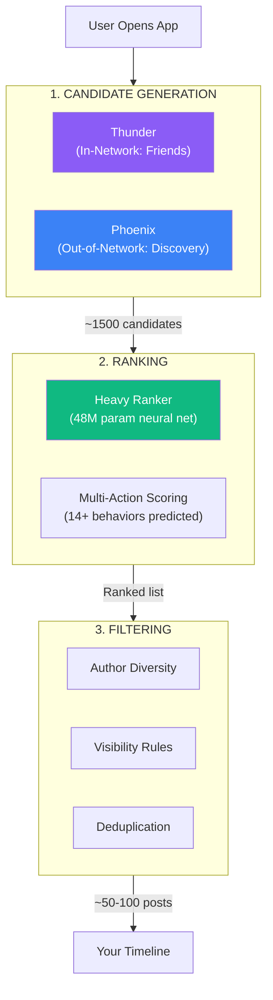
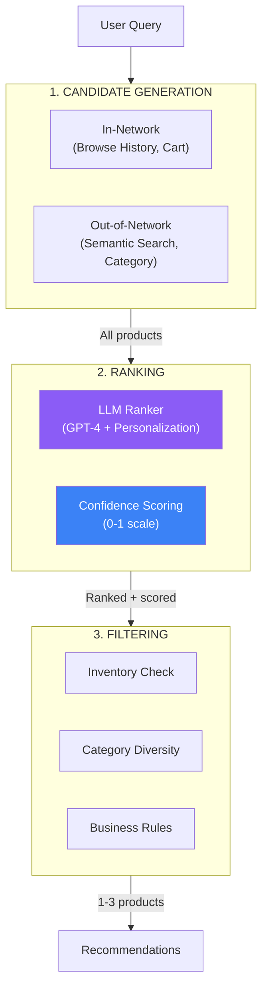

import Callout from '@components/Callout.astro';
import Mermaid from '@components/Mermaid.astro';
import AlgorithmFunnel from '@components/AlgorithmFunnel.astro';
import ScoringWeightsViz from '@components/ScoringWeightsViz.astro';
import TweetScoreCard from '@components/TweetScoreCard.astro';
import PlatformRadar from '@components/PlatformRadar.astro';
import EngagementFormula from '@components/EngagementFormula.astro';

## Introduction

*The algorithm that decides the fate of 500 million tweets a day is now open source. Here's how to steal its best ideas for your online store.*

In March 2023, Twitter (now X) did something unprecedented: they open-sourced their recommendation algorithm. The same system that determines what 500+ million users see on their timelines every day was suddenly available for anyone to study, critique, and—most importantly—learn from.

<Callout type="insight">
X processes 10,000+ candidates per request in under 500ms. What if your e-commerce recommendations could do the same?
</Callout>

This isn't just interesting for social media nerds. The core problem X solves—*"given millions of options, show the user the few most relevant ones, right now"*—is identical to what every e-commerce platform faces. Replace "tweets" with "products" and you've got the same challenge.

In this post, we'll dissect X's algorithm architecture, understand why it makes the decisions it does, and translate those patterns into practical e-commerce implementations. We'll use real code examples from [Hoodtopia](https://hoodtopia.vercel.app), an AI-powered e-commerce demo I built that applies these exact principles.

## The Three-Stage Pipeline

*Every recommendation system is a funnel. X's funnel has three stages with codenames that sound like military operations.*

At its core, X's recommendation system follows a classic pattern: generate candidates broadly, rank them precisely, filter for quality. But the devil is in the details.

<Mermaid>

</Mermaid>

<AlgorithmFunnel
  title="X's Recommendation Funnel"
  stages={[
    { name: "Candidates", count: 10000, description: "Raw pool from Thunder + Phoenix", color: "#8B5CF6" },
    { name: "After Ranking", count: 1500, description: "Scored by Heavy Ranker (48M params)", color: "#3B82F6" },
    { name: "After Filtering", count: 50, description: "Author diversity, visibility rules", color: "#10B981" }
  ]}
/>

### Stage 1: Candidate Generation

This is where the magic begins. X uses two systems with very different philosophies:

**Thunder** handles your "in-network" content—posts from people you follow. It's an in-memory store optimized for sub-millisecond latency. Think of it as your personalized cache of content from your social graph.

**Phoenix** is the discovery engine. It finds posts from people you *don't* follow but might want to. This is where X shows you viral tweets from strangers, niche content from communities you've never joined, and controversial takes that will keep you scrolling.

<Callout type="note">
Roughly 50% of what you see on X comes from Phoenix—content from people you don't follow. This is a massive shift from Twitter's original chronological feed.
</Callout>

### Stage 2: Ranking

The Heavy Ranker is where X's machine learning muscle flexes. This 48-million parameter neural network evaluates each candidate tweet and predicts the probability of 14+ different user actions: like, reply, retweet, profile click, dwell time, report, mute, block, and more.

But raw predictions aren't enough. X applies *weights* to each action, creating a composite score that determines ranking.

### Stage 3: Filtering

Even after ranking, the timeline isn't ready. Filters ensure diversity (no more than N posts from the same author), apply visibility rules (content warnings, sensitivity filters), and deduplicate (no showing the same content twice).

## The Scoring Formula

*Not all engagement is created equal. A reply is worth 27x a like. A block is catastrophic.*

This is where X's algorithm gets philosophical. By examining the open-sourced weights, we can see what X *values*. And the values are... interesting.

<EngagementFormula
  title="The X Scoring Formula"
  formula="Score = Σ (weight × P(action))"
  example={{
    pLike: { probability: 0.85, weight: 0.5, result: 0.425 },
    pReply: { probability: 0.65, weight: 13.5, result: 8.775 },
    pRetweet: { probability: 0.40, weight: 1.0, result: 0.400 },
    pBlock: { probability: 0.02, weight: -74.0, result: -1.480 },
    total: 8.12
  }}
/>

<ScoringWeightsViz
  title="X's Engagement Scoring Weights"
  weights={[
    { action: "Reply", weight: 13.5, type: "positive", description: "Conversations drive engagement" },
    { action: "Profile Click", weight: 12.0, type: "positive", description: "Deep interest signal" },
    { action: "Retweet", weight: 1.0, type: "positive", description: "Amplification" },
    { action: "Like", weight: 0.5, type: "positive", description: "Cheap signal" },
    { action: "Report", weight: -74.0, type: "negative", description: "Catastrophic" },
    { action: "Mute", weight: -74.0, type: "negative", description: "User explicitly doesn't want this" },
    { action: "Block", weight: -74.0, type: "negative", description: "Worst possible signal" }
  ]}
/>

### Why These Weights?

**Replies at 13.5x** are the key insight. X wants conversations, not passive consumption. A reply signals genuine engagement—you cared enough to formulate a response. Replies also create content that others might engage with.

**Profile clicks at 12x** signal deep interest. "Who IS this person?" means the content was interesting enough to investigate further. This often leads to follows, which increases platform stickiness.

**Likes at 0.5x** are cheap. Everyone knows this intuitively—you can like 100 posts while scrolling without much thought. The algorithm knows this too.

**Negative signals at -74x** are severe. One block hurts more than 148 likes help. This asymmetry is intentional—X would rather show you nothing controversial than risk you blocking someone.

<Callout type="warning">
The algorithm maximizes engagement while minimizing anger. A post likely to get liked AND blocked? It loses.
</Callout>

### A Real Example

Let's see how this plays out with a mock tweet:

<TweetScoreCard
  author="@karpathy"
  content="LLMs are the new CPUs. Every app will have one, most won't think about it, but those who understand them will build magic."
  timestamp="Jan 15, 2026"
  engagement={{
    likes: 42300,
    replies: 8900,
    retweets: 11200,
    profileClicks: 6800
  }}
  predictions={{
    pLike: 0.78,
    pReply: 0.52,
    pRetweet: 0.31,
    pBlock: 0.008
  }}
/>

Notice how the reply probability (0.65) dominates the score despite likes having a higher probability (0.85). The 13.5x weight on replies means they contribute far more to the final ranking.

## Gaming the Algorithm

*Now that we know the rules, let's break them (ethically).*

Understanding the weights reveals optimal posting strategies:

### Strategy 1: Spark Replies

If replies are worth 13.5x a like, optimize for responses. Ask questions. Share controversial (but not insane) opinions. Invite people to share their experiences.

**Example**: Instead of "I love coffee", try "What's your unpopular coffee opinion? Mine: cold brew is overrated."

### Strategy 2: Post Media

Images and videos increase "dwell time"—how long someone pauses on your post. Longer dwell = higher engagement probability = better ranking.

### Strategy 3: Engage Others

X uses something called "Real Graph"—a measure of your actual relationship with other users based on mutual interactions. If you regularly reply to someone, you're more likely to see their content. The reverse is also true.

<Callout type="success">
The optimal tweet: A provocative (but not insane) question with an image, posted when your audience is active, that invites people to share their experience.
</Callout>

### The Verified Boost

Yes, verified accounts get explicit ranking boosts. This is pay-to-play, but it's now transparent in the code. If you're building a presence on X, verification is effectively a ranking multiplier.

## X vs TikTok vs Meta

*Three giants, three philosophies, three different ways to capture your attention.*

X's algorithm isn't operating in a vacuum. It's competing against fundamentally different approaches from TikTok and Meta.

| Feature | X (Twitter) | TikTok | Meta |
|---------|------------|--------|------|
| **Core Signal** | Real-time text & replies | Watch time (retention) | Social graph |
| **Discovery** | 50% out-of-network | 100% algorithmic | Mostly friends |
| **Time Horizon** | Seconds (NOW) | Minutes (trends) | Days (highlights) |
| **The Goal** | "What's happening?" | "Entertain me" | "How are my friends?" |

<PlatformRadar
  title="Platform Algorithm Comparison"
  platforms={[
    { name: "X (Twitter)", color: "#1DA1F2", scores: { discovery: 7, realtime: 10, socialGraph: 8, personalization: 8, contentUnderstanding: 7, creatorEconomics: 5 }},
    { name: "TikTok", color: "#FF0050", scores: { discovery: 10, realtime: 6, socialGraph: 3, personalization: 10, contentUnderstanding: 10, creatorEconomics: 8 }},
    { name: "Meta", color: "#1877F2", scores: { discovery: 5, realtime: 4, socialGraph: 10, personalization: 7, contentUnderstanding: 8, creatorEconomics: 9 }}
  ]}
/>

<Callout type="note">
X is the only platform obsessed with NOW. TikTok wants to glue you to the screen, Meta wants to connect you to grandma, X wants to tell you the world is burning—in real-time.
</Callout>

### The TikTok Difference

TikTok doesn't care who you follow. Your entire feed is algorithmically curated based on watch behavior. Pause for 3 seconds on a cat video? You're getting more cat videos. This creates an insanely tight feedback loop but means your social graph is almost irrelevant.

### The Meta Approach

Meta still heavily weights your social graph. Despite years of algorithmic tuning, the core premise remains: you're here to see content from people you know. Discovery exists but is secondary.

### Why This Matters for E-commerce

These three philosophies map directly to e-commerce recommendation strategies:

- **X-style**: "What's trending RIGHT NOW?" (flash sales, live inventory)
- **TikTok-style**: "Based on your behavior, here's what you'll love" (pure personalization)
- **Meta-style**: "Your friends bought this" (social proof, collaborative filtering)

The best e-commerce systems blend all three.

## Translation to E-commerce

*At its core, Twitter recommends tweets. E-commerce recommends products. The underlying problem is identical.*

Let's map X's architecture to an e-commerce context:

<Mermaid>

</Mermaid>

### The Translation Table

| X Concept | E-commerce Equivalent |
|-----------|----------------------|
| **Thunder** (in-network) | Browse history, cart items, past purchases |
| **Phoenix** (out-of-network) | Semantic search, category neighbors, trending |
| **P(like)** | P(click) - Will they click this product? |
| **P(reply)** | P(add_to_cart) - Will they add to cart? |
| **P(retweet)** | P(share) - Will they share/recommend? |
| **P(block)** | P(bounce) - Will they leave the site? |
| **Heavy Ranker** | LLM with personalization context |
| **Author diversity** | Category diversity |
| **SimClusters** | Shopper profiles/personas |

## Code Examples from Hoodtopia

*Let's get concrete. Here's how Hoodtopia implements each stage of the X-inspired pipeline.*

### Stage 1: Candidate Generation (Browse History)

Just like X's Thunder tracks your engagement with accounts you follow, we track product interactions to build "in-network" candidates:

```typescript
// Hoodtopia's "engagement history" equivalent
// File: src/hooks/use-browse-history.ts

const getPersonalizationContext = useCallback(() => {
  const recentItems = getRecentlyViewed(10);
  const topCategories = getTopCategories();

  return {
    viewedProducts: recentItems.map(item => item.productName),
    viewedCategories: topCategories.slice(0, 3),
    timeSpent: history.totalTimeSpent,  // Like X's "dwell time"
    mostViewedProduct: recentItems[0]?.productName,
    preferredCategory: topCategories[0],
  };
}, [history, getRecentlyViewed, getTopCategories]);
```

This context flows into every AI recommendation request, just like X's user features flow into the Heavy Ranker.

### Stage 2: Ranking (LLM-Powered)

X uses a 48M-parameter neural network. For smaller-scale e-commerce, we can use an LLM with carefully crafted prompts that include personalization signals:

```typescript
// The personalization prompt—our "feature engineering"
// File: src/services/ai.ts

let personalizationSection = "";
if (personalizationContext?.viewedProducts.length > 0) {
  personalizationSection = `
## User's Browsing History
- Recently viewed: ${personalizationContext.viewedProducts.join(", ")}
- Categories browsed: ${personalizationContext.viewedCategories.join(", ")}
- Time spent: ${Math.round(personalizationContext.timeSpent / 60)} min

**Instructions:**
- Weight recommendations toward browsing history
- Reference viewed products when relevant
- Consider their category preferences
`;
}
```

The LLM becomes our ranker, using natural language understanding instead of learned embeddings—but the goal is identical: predict which products will generate the desired actions.

### Stage 3: Filtering (Zod Schemas)

X filters for author diversity and content policies. We filter for structured validity and business rules:

```typescript
// Structured output = guaranteed valid recommendations
// File: src/services/schemas.ts

export const RecommendationItemSchema = z.object({
  productName: z.string().describe("Exact product name from catalog"),
  reason: z.string().describe("Why this matches user needs"),
  confidence: z.number().min(0).max(1),  // Our ranking score
  highlightedFeatures: z.array(z.string()),
});
```

The confidence score (0-1) serves the same purpose as X's composite engagement score—it's a single number that determines ranking order.

## Shopper Profiles (X's Interest Clusters)

*X uses SimClusters to group users by interest. Hoodtopia makes this explicit with 5 shopper personas.*

SimClusters is X's system for understanding user interests at scale. It groups users and content into overlapping clusters, enabling recommendations across interest boundaries.

For e-commerce, we can make this explicit with shopper profiles that adapt both the AI personality and the UI:

| Profile | AI Personality | UI Adaptation |
|---------|---------------|---------------|
| **Minimalist** | Concise, 1-2 sentences | Quick-buy, minimal specs |
| **Researcher** | Detailed, data-driven | Full specs, comparisons |
| **Trendsetter** | Style-focused, visual | Large images, subtle prices |
| **Budget Hunter** | Price-first, value-focused | Prominent prices, deals |
| **Explorer** | Playful, discovery-oriented | Variety, new products |

```typescript
// Adaptive AI personalities per shopper profile
// File: src/lib/shopper-profiles.tsx

const profilePrompts = {
  budget_hunter: `## The Budget Hunter
- ALWAYS mention prices first
- Highlight value and savings
- Suggest bundles or deals
- Be practical and cost-conscious`,

  researcher: `## The Researcher
- Provide ALL specifications
- Compare products with metrics
- Be thorough and comprehensive
- Use numbers and percentages`,
};
```

This is fundamentally the same pattern as X's interest-based personalization—but made explicit and user-controllable.

## Conclusion

*The X algorithm isn't magic. It's engineering. And now it's your blueprint.*

The patterns we've explored—three-stage pipelines, multi-signal scoring, asymmetric negative weights, interest clustering—aren't specific to social media. They're universal principles for any system that must surface relevant content from a large pool.

<Callout type="insight">
The core pattern: Source candidates broadly, score them with a model that understands user context, filter with business rules. Whether you're ranking tweets or hoodies, the architecture is the same.
</Callout>

### Key Takeaways

1. **The funnel matters**: Candidate generation → Ranking → Filtering. Each stage has a specific job.

2. **Weight your signals**: Not all user actions are equal. Replies (or add-to-carts) are more valuable than likes (or views).

3. **Negative signals are catastrophic**: One block destroys 148 likes worth of value. Design your negative weights accordingly.

4. **Personalization is table stakes**: X uses your entire interaction history. Your e-commerce should too.

5. **Transparency builds trust**: X's open-sourcing was controversial but educational. Consider what you can share about your own systems.

### Further Reading

- [X's Algorithm Repository](https://github.com/twitter/the-algorithm) - The actual source code
- [Hoodtopia Demo](https://hoodtopia.vercel.app) - Try these patterns live
- [LangChain Documentation](https://js.langchain.com/) - Building LLM-powered rankers

The algorithm is open. The patterns are clear. Now it's your turn to build something great.

---

*Have questions about implementing these patterns? Find me on [X](https://x.com/marcus_elwin) or [LinkedIn](https://linkedin.com/in/marcuselwin).*
